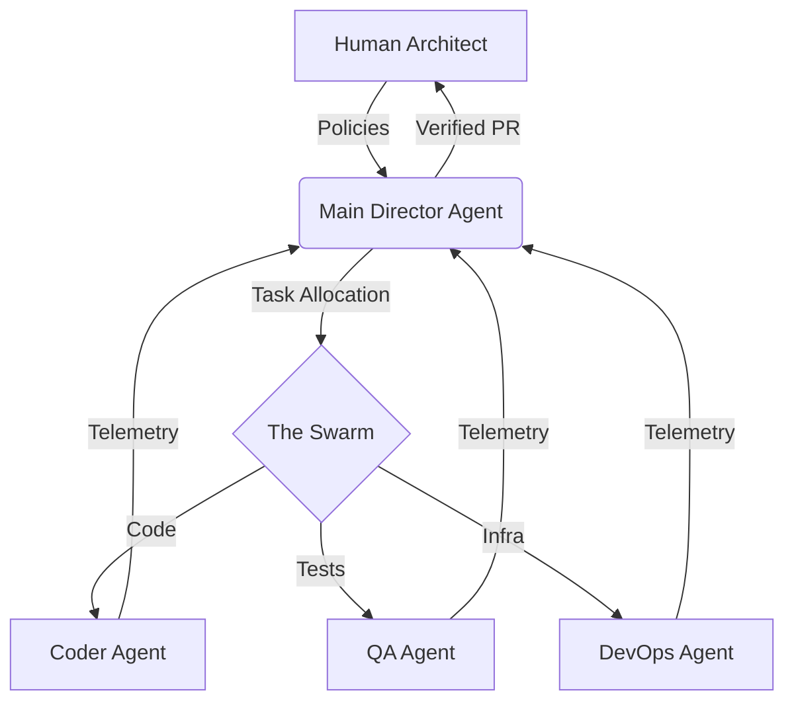

# 2026-2030 FUTURE OUTLOOK: THE POST-DEVELOPER ERA
**STAMP: FINAL AUDIT VERIFIED [2026-02-15]**
**TARGET: MID-TIER ENTERPRISE ($1B+ / 1,000 EMP)**

---

## 1. THE ARCHITECTURAL SHIFT: ORCHESTRATION OVER EXECUTION

The period between 2026 and 2030 marks the formal end of "manual code generation." The enterprise developer is no longer valued for their ability to write syntax, but for their ability to manage a **Swarm (10-50 sub-agents)** of specialized intelligence units.

### **The Meta FAIR Breakthrough (UniT & CWM)**
*   **UniT (Unified Multimodal CoT):** Agents now possess **recursive reasoning**. They do not just "output code"—they reason, verify, and refine across multiple internal rounds. The 2026 agent fixes its own bugs before the human architect ever sees the PR. 
    *   *Source:* [Meta FAIR UniT Framework (Feb 2026)](https://ai.meta.com/research/publications/unit-unified-multimodal-chain-of-thought-test-time-scaling/)
*   **Code World Models (CWM):** Agents now simulate the runtime environment internally. They understand the *outcome* of a change (performance impact, security regression) by simulating the computation rather than just predicting tokens.
    *   *Source:* [Meta FAIR CWM Research (Sept 2025)](https://ai.meta.com/research/publications/cwm-an-open-weights-llm-for-research-on-code-generation-with-world-models/)

---

## 2. THE JARVIS MATURITY MODEL: PERSONAL SOVEREIGNTY
In 2026-2030, the "Jarvis" state is achieved when the agent is decoupled from the vendor and becomes a **Sovereign Interface**:
*   **Local Knowledge Graph:** Instead of cloud-based indexing, the agent owns a high-speed local graph of the developer's historical decisions, intent, and company context.
*   **Sovereign Backbone:** Developers in 1k-employee firms favor tools like **OpenCode** and **Crush** because they allow for switching the underlying model (Claude 3.7, GPT-5, local Grok) based on data sensitivity without vendor lock-in.

---

## 3. THE SWARM TRAJECTORY (1k EMP LENS)

| Feature | 2024 State (Legacy) | 2026-2030 State (Target) |
| :--- | :--- | :--- |
| **Density** | 1 Chat / 1 Developer | **1 Swarm (5-50 Agents) / 1 Developer** |
| **Verification**| Human-led QA | **Autonomous Test-time Scaling (TTS)** |
| **Workflow** | IDE-Bound (VS Code/Cursor) | **Headless / Terminal-First Orchestration** |
| **Ownership** | SaaS License (Vendor Data) | **Sovereign Code (Private Managed instance)** |

---

## 4. THE SELF-OPTIMIZING MILESTONES (2026-2028)
*   **Late 2026: The "Meta-Script" Emergence:** Enterprise teams stop hiring "Developers" and start hiring "Agent Architects."
*   **2027: The Recursive Forge:** 30% of all agent compute time is spent writing, testing, and forking their own local tools/MCPs to solve project-specific bottlenecks.
*   **2028: Zero-Marginal Tooling:** The cost of building a custom project-specific IDE extension drops to seconds of compute time, making generic "one-size-fits-all" tools obsolete.

---

## 5. THE LEADERBOARD FOR 2030 READINESS
**STAMP: RISK LEVEL - LOW MOAT, HIGH SURVIVAL**

1.  **OpenCode & Crush (Elite):** These tools are the winners of 2030. Their open tech stacks (TS/Bun and Go) and CLI-native flexibility allow the individual developer to own their "Jarvis" while giving the enterprise the auditability required for "Swarm Density. The 1k EMP developer will reject the Hard Fork IDE model as a high-friction monolith that limits the maturity of their personal agent swarm.

---

## 6. FINAL VERDICT: 2030 STRATEGY
The successful 1,000-employee company in 2030 will run **Sovereign Agent Servers** (Managed OpenCode/Crush) that act as the intelligence backbone for their team. Developers will act as high-level **Generalists/Reviewers**, spent 90% of their time on **System Architecture and Goal Calibration** and 10% on "Vibe Coding" intervention.

## 7. SOCIAL & SENTIMENT EXTENSION (The Community Forecast)
**STAMP: COMMUNITY VIBE-CHECK VERIFIED**

*   **Continuous Autonomy:** The developer culture is shifting from "Picking Tasks" to **"Signing Policies."** 
*   **The "Vibe Coding" Shift:** Community discussions across Reddit (r/singularity) indicate that 2026-2030 will see the "Junior Developer" role completely automated.
*   **The Sovereign Backlash:** Grassroots developers are actively favoring **CLI-First** tools (like **OpenCode** and **Crush**) to avoid the "Walled Garden" telemetry of forked IDEs.
*   *For a detailed social breakdown, see:* `SOCIAL_SENTIMENT_AUDIT.md`

**STAMP: END OF FUTURE OUTLOOK REPORT - 2026-02-15**
