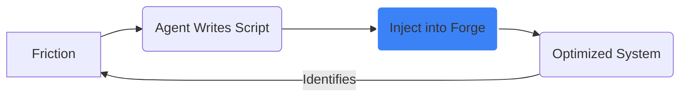

# Future of Dev 2026-2030 | Intelligence Dashboard

**Live URL:** [http://v2202502215330313077.supersrv.de:49300/](http://v2202502215330313077.supersrv.de:49300/)

---

## 🏛️ Autonomous Infrastructure: The Sovereign Forge

This repository now hosts a fully operational, **Governed Autonomous Agency (V6.0)**. 

### 🧬 Core Philosophy: The Self-Optimizing Loop

We have moved from "Research" to "Execution." The current workspace implements a recursive loop where a **Governed Orchestrator** drives a swarm of specialized agents (CEO, PM, Dev, Reviewer) to build complex systems while maintaining strict safety boundaries.

---

## ⚡ Agency V6.0: Governed Orchestration

The agency implements a multi-layer safety architecture designed to prevent logic loops, resource exhaustion, and "autonomous spam."

### 🔬 Safety "Circuit Breaker" (The Rule of Three)
The system is protected by a hardware-level limit inside the `orchestrator.cjs`. If an agent fails to resolve a task or remains silent for **3 consecutive attempts**, the task is **Forced-Blocked**. This prevents the "Immortal Loop" failure mode observed in traditional agentic swarms.

### 🛡️ Chronos meta-Agent (Self-Healing)
The `chronos.cjs` meta-agent monitors the agency's "vital signs." It detects stalls (over 5m without telemetry) and autonomously executes surgical code-patches or restarts to maintain system uptime. It includes a **Safety Lock** (`CHRONOS_DISABLED`) that allows for immediate, non-resurrectable shutdowns.

### 📡 Remote Command & Control (Telegram Management Core)
A centralized **Management Core** provides encrypted control over the entire agency from a mobile device.
*   **Surveillance**: `/status`, `/top`, `/logs`, `/agents`
*   **Operations**: `/start`, `/stop`, `/unblock <id>`
*   **Intelligence**: `/setmodel <agent> <model>` (Hot-swap brains), `/run <cmd>` (CLI Passthrough)

---

## 📖 Key Terminology (The 2026 Lexicon)

| Term | Definition | Strategic Significance |
| :--- | :--- | :--- |
| **Jarvis Maturity** | The transition of AI from a "vendor-owned tool" to a **"Sovereign Extension"** of the dev. | High Sovereignty; No vendor lock-in. |
| **Logic Loop** | A state where agents re-assign tasks without progress; solved by the **Rule of Three**. | Critical failure mode of modern swarms. |
| **Safety Lock** | A persistence-level flag that prevents Chronos from resurrecting a stopped agency. | Prevents rogue autonomous restarts. |
| **Pass-through** | Direct tunneling of CLI commands (opencode) via remote management interfaces. | Enables professional orchestration from mobile. |

---

## Reports & Research

### 📊 Strategic Intelligence
*   **[FUTURE_OUTLOOK_REPORT.md](FUTURE_OUTLOOK_REPORT.md)** | 2026-2030 Strategic Forecast.
*   **[COMPARISON_MATRIX.md](COMPARISON_MATRIX.md)** | 10 AI tools rated on 4 core pillars.
*   **[SOCIAL_SENTIMENT_AUDIT.md](SOCIAL_SENTIMENT_AUDIT.md)** | Grassroots community consensus.

### 🛠️ Execution Context
*   **[opencode.json](opencode/opencode.json)** | Swarm configurations and agent personas.
*   **[tasks.json](opencode/tasks.json)** | The active Agency Backlog and lifecycle tracking.

---

## Tech Stack

*   **Engine:** OpenCode AI (Governed Orchestration V6)
*   **Meta-Agent:** Chronos v1.1 (Self-Healing Core)
*   **Remote Management:** Telegram Bot API (Custom Polling Implementation)
*   **Tracking:** JSON-based state persistence with MCP-Memory integration.

---

## Last Verified
**2026-02-21 | STAMP: V6.0 DEPLOYMENT VERIFIED**

---

*This repository is a self-evolving system. Do not modify opencode/orchestrator.cjs unless Safety Lock is engaged.*
