# Phase 1: Equip the Developer – KPI Assurance During Development

**Goal:** Configure OpenCode so that a developer automatically meets 3 KPIs *while developing* (not just at the end):
1. **Test Coverage** ≥ 80% (backend Go + frontend Vue)
2. **Code Quality** – 0 lint/type errors
3. **Performance** – no regression >10% (backend: p95 latency)

And have an automated pre-commit gate that blocks commits if KPIs are not met.

---

## 1. What We Built (NOT MCP)

**IMPORTANT:** The MCP server approach was tried and **FAILED**. The correct OpenCode pattern uses **specialized agents + custom commands**.

### Already Implemented

The project `.opencode/` directory contains:

- **4 Specialized Agents:**
  - `kpi-guard` (default) - KPI enforcement & reminders
  - `backend-specialist` - Go/Gin backend with tests
  - `frontend-specialist` - Vue 3 + TypeScript with type safety
  - `devops` - Performance, Docker, CI/CD

- **9 Custom Commands:**
  - `/kpi-check` - Full KPI validation (coverage + quality + performance)
  - `/coverage-backend` - Check Go coverage ≥80%
  - `/coverage-frontend` - Check Vue coverage ≥80%
  - `/quality` - Lint + type checks (0 errors)
  - `/performance` - Load test vs baseline (≤10% regression)
  - `/test-backend` - Run Go test suite
  - `/test-frontend` - Run Vue test suite
  - `/build-all` - Build production artifacts
  - `/kpi-fix` - Auto-fix common issues

- **Loaded Instructions:**
  - `project-structure.md` - Directory layout & conventions
  - `kpi-policy.md` - Detailed KPI rules, exemptions, troubleshooting

Configuration is complete in `.opencode/opencode.json` with `default_agent: kpi-guard`.

No manual OpenCode configuration needed - just run `opencode` in the project root.

---

## 1.5. Workflow Diagrams

### Complete KPI Enforcement Flow

```mermaid
flowchart TD
    Start([🚀 Developer Starts Task]) --> A[Launch OpenCode<br/>KPI-Guard Active]
    A --> B{Select Context}
    
    B -->|Backend| C[Tab: backend-spec]
    B -->|Frontend| D[Tab: frontend-spec]
    B -->|Performance| E[Tab: devops-spec]
    
    subgraph Iteration ["Inner Loop (Development)"]
        C & D & E --> F[Write Code + Tests]
        F --> G{Check KPIs?}
        G -->|Manual| H["Run /kpi-audit<br/>(Coverage, Quality, Perf)"]
        G -->|Auto| I[Agent Real-time Feedback]
        
        H & I --> J{Thresholds Met?}
        J -->|❌ Fail| L[Agent Suggests Fixes]
        L -->|"/fix coverage"<br/>"/refactor quality"| F
    end

    J -->|✅ Pass| K[Local Readiness Confirmed]
    
    subgraph GitHooks ["The Gatekeepers"]
        K --> N[git commit]
        N --> O{Pre-commit Hook}
        O -->|Fail: Lint/Tests| R[❌ Commit Blocked]
        R --> L
        
        O -->|Pass| Q[✅ Commit Success]
        Q --> S[git push]
    end

    subgraph CICD ["Cloud Validation"]
        S --> T{CI/CD Pipeline Audit}
        T -->|Fails p95/LCP/Coverage| V[❌ PR Blocked]
        V --> F
        T -->|All Green| U([🏁 Merge to Main])
    end

    style Start fill:#f0f9ff,stroke:#0369a1
    style U fill:#f0fdf4,stroke:#15803d
    style R fill:#fef2f2,stroke:#b91c1c
    style V fill:#fef2f2,stroke:#b91c1c
    style Iteration fill:#f8fafc,stroke:#64748b,stroke-dasharray: 5 5
```

### Example: Adding a New Backend Endpoint

```mermaid
sequenceDiagram
    actor Dev as Developer
    Dev->>OpenCode: "Create GET /api/v1/items handler"
    OpenCode->>OpenCode: Switch to backend-specialist context
    OpenCode->>Dev: Implement handler + table-driven tests
    Dev->>OpenCode: "/test-backend"
    OpenCode->>Backend: go test ./... -cover
    Backend-->>OpenCode: Coverage: 87% ✓
    OpenCode-->>Dev: "✅ Coverage 87%, lint clean"
    Dev->>OpenCode: "/quality"
    OpenCode->>Backend: golangci-lint + go vet
    Backend-->>OpenCode: 0 errors ✓
    OpenCode-->>Dev: "✅ All quality checks passed"
    Dev->>Git: git add .
    Git->>pre-commit: Run KPI validation
    pre-commit->>Backend: Full test + lint + vet
    Backend-->>pre-commit: All pass ✓
    pre-commit-->>Git: Commit approved
    Git-->>Dev: ✅ Commit successful
```



### Example: Adding a Frontend Component

```mermaid
sequenceDiagram
    actor Dev as Developer
    Dev->>OpenCode: "Create ItemList.vue with Pinia store"
    OpenCode->>OpenCode: Switch to frontend-specialist
    OpenCode->>Dev: Generate component + store + tests
    Dev->>OpenCode: "/test-frontend"
    OpenCode->>Frontend: npm run test:unit -- --coverage
    Frontend-->>OpenCode: Coverage: 92% ✓
    OpenCode-->>Dev: "✅ Coverage 92%"
    Dev->>OpenCode: "/quality"
    OpenCode->>Frontend: npm run lint && npm run type-check
    Frontend-->>OpenCode: 0 errors ✓
    OpenCode-->>Dev: "✅ Lint & type clean"
    Dev->>Git: git add .
    Git->>pre-commit: Validate KPIs
    pre-commit->>Frontend: Tests + coverage + lint + type-check
    Frontend-->>pre-commit: All pass ✓
    pre-commit-->>Git: Commit approved
    Git-->>Dev: ✅ Committed
```



### KPI Check Locations in the Pipeline

```mermaid
flowchart LR
    A[Local Dev<br/>OpenCode Agent] -->|Real-time reminders| B[Developer]
    B -->|Before commit| C[pre-commit hook<br/>❌ Blocks violations]
    C -->|Successful commit| D[Git Push]
    D -->|Before remote| E[pre-push hook<br/>❌ Double-check]
    E -->|Pushes| F[GitHub PR]
    F -->|On PR| G[CI: kpis.yml<br/>❌ Blocks merge]
    G -->|All pass| H[Merged to main]
    
    style C fill:#ffcccb
    style E fill:#ffcccb
    style G fill:#ffcccb
```



---

## 3. Daily Developer Workflow

## 2. Pre-Commit Hook – Automated Gate

The pre-commit hook is **already installed** and enforces all 3 KPIs automatically:

- **Go files changed:** Runs full project tests (coverage ≥80%), golangci-lint, go vet
- **Vue files changed:** Runs full project tests with coverage (≥80%), eslint, vue-tsc
- **Performance:** Skipped in pre-commit (needs running server) - run manually with `/performance`

The hook **blocks commits** that violate KPIs. It auto-triggers on `git commit`. No setup required.

### Verify It Works

```bash
# Make any change, then:
git add .
git commit -m "test"
# Hook runs and either passes or blocks with error message
```

### Manual KPI Validation

Run anytime (outside commit):

```bash
# All KPIs
bash scripts/kpi-check.sh

# Or individual checks
cd backend && go test ./... -cover
cd frontend && npm run test:unit -- --coverage
cd frontend && npm run lint && npm run type-check
```

---

## 3. Daily Developer Workflow

### Starting

```bash
cd /root/Erp_dev_bench-2
opencode  # Launches TUI with kpi-guard agent
```

### Agent Switching

Press `Tab` to cycle:
- **kpi-guard** - KPI oversight (default)
- **backend-specialist** - Go/Gin development
- **frontend-specialist** - Vue 3/TypeScript
- **devops** - Performance & builds

### Backend Example

1. Switch to `backend-specialist` (Tab)
2. Ask: "Create Gin handler GET /api/v1/items with table-driven tests"
3. Agent implements with tests targeting ≥80% coverage
4. Run: `/test-backend` to verify
5. If coverage low: "Add more tests to reach 80%"
6. Run: `/quality` to check lint/vet
7. For performance: start server, run `/performance`

### Frontend Example

1. Switch to `frontend-specialist`
2. Ask: "Create ItemList Vue component with Pinia store and tests"
3. Agent creates component + store with proper TypeScript types
4. Run: `/test-frontend` to verify coverage ≥80%
5. Run: `/quality` (frontend) for lint + type errors
6. If any `any` types: "Replace with proper interfaces"

### Committing

```bash
git add .
# pre-commit auto-runs KPI checks
git commit -m "feat: description"  # Fails if KPIs not met
git push  # pre-push re-validates
```

### When a KPI Fails

**Coverage < 80%:**
```
/kpi-check
# Then: "Add tests to reach 80% coverage for uncovered functions"
```

**Lint/Type errors:**
```
/kpi-fix
# Or: "Fix all ESLint errors in this file"
```

**Performance regression:**
```
# Start server first
cd backend && go run ./cmd/main.go
/performance
# If regression: "Profile endpoint and suggest optimizations"
```

**Exemptions:** Rarely allowed. Document with comment:
```go
// KPI-EXEMPT: Third-party integration - cannot mock external API
// Ticket: ERP-123
```

---

## 4. Infrastructure Already in Place

### OpenCode Configuration

```
.opencode/
├── opencode.json           # Main config (agents, commands, instructions)
├── agents/                 # 4 specialized agents
│   ├── kpi-guard.md
│   ├── backend-specialist.md
│   ├── frontend-specialist.md
│   └── devops.md
├── commands/               # 9 custom commands
│   ├── kpi-check.md
│   ├── coverage-backend.md
│   ├── coverage-frontend.md
│   ├── quality.md
│   ├── performance.md
│   ├── test-backend.md
│   ├── test-frontend.md
│   ├── build-all.md
│   └── kpi-fix.md
└── instructions/
    ├── project-structure.md
    └── kpi-policy.md
```

### Git Hooks

```
.git/hooks/
├── pre-commit    # KPI validation (installed, executable)
└── pre-push      # Re-validation (installed)
```

### Helper Scripts

```
scripts/
├── kpi-check.sh           # Run all KPI checks manually
└── perf_check.sh          # Performance regression check

.opencode/tools/
├── get-coverage.sh        # Extract coverage numbers
├── get-lint-count.sh      # Count lint errors
├── get-baseline.sh        # Read performance baselines
└── update-baseline.sh     # Update baselines
```

### CI/CD (GitHub Actions)

```
.github/workflows/
├── kpis.yml        # PR validation - runs KPI checks
├── benchmark.yml   # Nightly performance benchmarks
└── docker.yml      # Build & push images
```

### Documentation

- `AGENTS.md` - Quick reference for agents & commands
- `CONTRIBUTING.md` - Updated KPI workflow for developers
- `baseline.json` - Performance baselines (p95 latencies)

---

## 5. Vue Frontend Specifics

- **Coverage:** Vitest + Vue Test Utils, target ≥80% lines
- **Linting:** ESLint + @vue/eslint-config-typescript, 0 errors
- **Type Check:** vue-tsc --noEmit, must pass
- **Performance:** Lighthouse NOT in current KPIs (too slow). Only backend p95 tracked.

If Lighthouse needed, add to nightly CI, not pre-commit.

---

## 6. Performance Baseline Management

`baseline.json`:

```json
{
  "endpoints": {
    "/api/health": {
      "p95_ms": 5,
      "method": "GET",
      "description": "Health check"
    }
  },
  "last_updated": "2025-02-26T00:00:00Z"
}
```

**Measure baseline:**
1. Start backend: `cd backend && go run ./cmd/main.go`
2. Run: `bash scripts/perf_check.sh /api/health 10`
3. If successful, manually update `baseline.json` with measured p95

**Update baseline after improvement:**
```bash
.opencode/tools/update-baseline.sh /api/health 4.2
```

---

## 7. Quick Reference

### OpenCode Commands

| Command | Agent | Purpose |
|---------|-------|---------|
| `/kpi-check` | kpi-guard | Full validation |
| `/coverage-backend` | backend | Go coverage |
| `/coverage-frontend` | frontend | Vue coverage |
| `/quality` | any | Lint + type check |
| `/performance` | devops | Load test vs baseline |
| `/test-backend` | backend | Run Go tests |
| `/test-frontend` | frontend | Run Vue tests |
| `/build-all` | devops | Build production |
| `/kpi-fix` | kpi-guard | Auto-fix issues |

### Verification

```bash
# Test pre-commit hook
touch backend/test.go
git add backend/test.go
git commit -m "test"  # Should run and show results

# Manual KPI check
bash scripts/kpi-check.sh
```

---

## Phase 2: CI Integration ✅ ALREADY DONE

The CI/CD pipeline is fully implemented:

- `.github/workflows/kpis.yml` - PR KPI validation
- `.github/workflows/benchmark.yml` - Nightly performance benchmarks
- `.github/workflows/docker.yml` - Docker build & push

No additional setup required. The entire KPI enforcement pipeline is operational from local dev to CI.

---

## What Changed from Original Plan

| Original Document | Actual Implementation |
|-------------------|----------------------|
| MCP servers for KPI tools | ❌ Failed - agents + commands ✅ |
| System prompt with KPI rules | ❌ Not needed - agents have built-in prompts ✅ |
| Manual pre-commit setup | ✅ Already installed (improved version) |
| Lighthouse included | ❌ Removed (not in current stack) ✅ |
| Files to create | ✅ All files already created ✅ |

**Phase 1 is complete and working.** The system enforces 3 KPIs automatically during development, at commit time, and in CI.

---
