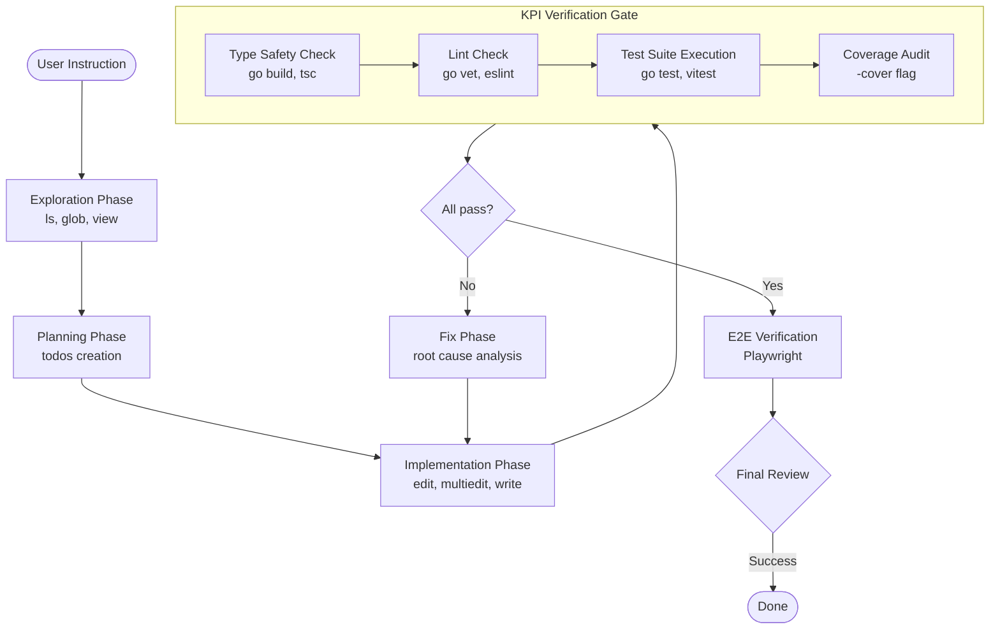
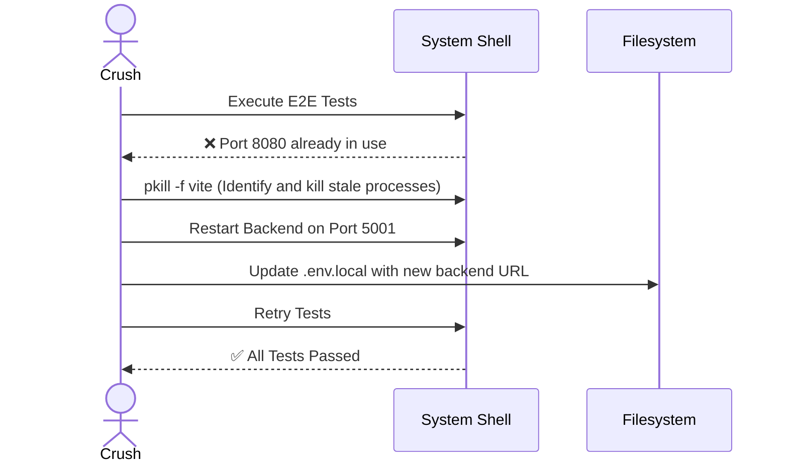

# Phase 1: Equip the Developer – Crush Autonomous Agency

**Crush** is a high-performance AI Agent residing in the CLI, specialized for autonomous development with strict KPI compliance. Unlike standard IDE extensions, Crush is designed to explore, build, and verify end-to-end solutions with minimal human intervention.

## 1. Capabilities & Integrated Toolset

Crush operates with a rich suite of CLI tools, enabling deep filesystem manipulation and real-time verification.

*   **Filesystem Management**: `ls`, `view`, `write`, `edit`, `multiedit` (for sequential surgical changes).
*   **Discovery**: `grep`, `glob`, `lsp_references` (semantic-aware searching).
*   **Execution**: `bash` (unrestricted command execution with background task support).
*   **Verification**: Integrated `webapp-testing` (Python-based Playwright) and native test runners (`go test`, `vitest`).
*   **Orchestration**: `todos` (dynamic task management) and the ability to spawn sub-agents for parallel research.

## 2. Alignment Architecture: Codifying Standards

Alignment with the project's specific needs is achieved through **dynamic documentation and configuration automation**, ensuring Crush adheres to team-specific standards without manual oversight.

### 2.1. The AGENTS.md Protocol
The project root contains an `AGENTS.md` file designed as a persistent memory layer for autonomous agents. It is established during the project's initialization:
*   **Discovery Phase**: Crush analyzes the entire codebase (Makefile, package.json, source files) to identify the tech stack and valid commands.
*   **KPI Mapping**: Mandatory commands for Type Safety, Linting, Building, and Testing are documented with fallbacks.
*   **Pattern Enforcement**: Architectural layers (e.g., Services, Repositories) and naming conventions (e.g., `Base*.vue`) are recorded.
*   **Gotcha Mitigation**: Non-obvious project specificities (e.g., port conflicts, environment variable prefixes) are surfaced.

### 2.2. Configuration Automation
To minimize human error and alignment drift, Crush automates global settings:
*   **SCSS Global Injection**: Configuring `vite.config.ts` with `additionalData` to make design tokens available everywhere, removing the need for manual imports.
*   **Auto-Import Tuning**: Updating plugin configurations to ensure Pinia stores and Vue APIs are type-safe and globally available.
*   **Environment Syncing**: Generating `.env.local` and `.env` templates to ensure backend/frontend communication is pre-configured for testing.

## 3. Methodology: Autonomous KPI Compliance

Crush doesn't just write code; it ensures the code is **production-ready** by following a mandatory compliance cycle defined in the project's `AGENTS.md`.

### 2.1. The Crush Verification Lifecycle
Every task follows this loop before completion:
1.  **Exploration**: `ls` and `view` to understand existing code patterns and architectural layers.
2.  **Implementation**: Surgical edits matched against exact whitespace/indentation to maintain code style.
3.  **Verification**: 4-point KPI check (Build, Lint, Type-Safety, Tests & Coverage).

### 2.2. Test-First Policy
Crush enforces a strict testing standard across all layers:
*   **Backend**: Mock-driven handler tests (`testify/mock`) + Integration repository tests (SQLite in-memory).
*   **Frontend**: Store/Composable unit tests (Vitest) + Playwright E2E flows (real browser verification).
*   **Performance**: Local verification of backend p95 latency where applicable.
*   **Coverage**: Mandatory target of **>80% line coverage** for new business logic.

## 3. Workflow Diagrams

### 3.1. The Crush Task Execution Flow

### 3.2. Error Remediation Strategy
Crush handles system-level blockers (e.g., ports, missing dependencies) without human intervention.

## 4. Communication Protocol
*   **Conciseness**: Final responses are optimized for speed (< 4 lines of text).
*   **Precision**: Technical, file-specific references (`file_path:line_number`).
*   **Responsibility**: Always verifies its own work; never asks the user to "try it out."
*   **Tone**: Direct, factual, and strictly technical.

## 5. Critical Constraints
*   **READ BEFORE EDIT**: Never modifies a file without establishing context via `view`.
*   **EXACT MATCHING**: Uses literal strings including all whitespace to ensure non-destructive editing.
*   **KPI DRIVEN**: If a change breaks a KPI, Crush reverts or fixes before reporting status.

## 6. Advanced Setup: The .crush/ Manual

To scale beyond basic instructions, Crush implements a modular **Autonomous Agent Instruction Set (AAIS)** housed in a `.crush/` directory. This structure serves as the agent's "Operational Brain."

### 6.1. Modular Knowledge Architecture
| File | Purpose |
|------|---------|
| `manifest.md` | **The Entry Point**: Maps project tech stacks to relevant logic sub-sets. |
| `kpi_vault.md` | **Quality Gates**: Strict definitions of the 4 KPIs with exact command strings and fallbacks. |
| `patterns.md` | **Blueprints**: Structural templates for code (e.g., Service/Repository layers, component boilerplates). |
| `troubleshooting.md` | **Learned Memory**: Logs solved environment blockers (e.g., stale Vite processes, port conflicts). |
| `verification.md` | **Testing Library**: Standardized "Reconnaissance-then-Action" patterns for Playwright/E2E verification. |

### 6.2. Benefits of Modular Alignment
*   **Operational Persistence**: Learned solutions (like today's `pkill vite` necessity) are codified, ensuring future agents avoid the same pitfalls.
*   **Context Optimization**: Crush "loads" only the specific knowledge modules required for a given sub-task (e.g., Backend logic), keeping the context window focused.
*   **Zero-Config Scaling**: New repositories can be "Crush-equipped" by simply initializing the `.crush/` layer, allowing the agent to self-onboard via its discovery flow.

---

*Last Updated: 2025-02-26*
