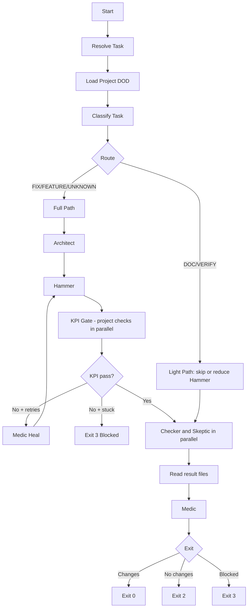

# Agency Broad Change Plan

Single set of edits to get: **project-side DOD**, **adaptive routing**, **agent outcomes**, and **parallelization**. All in the opencode orchestrator and related files; LangGraph can be updated in a follow-up to match.

---

## 1. Project-Side Definition of Done (DOD)

**Goal:** KPI and "done" live in the workspace. No hardcoded gofmt/npm/red-test in the agency.

**1.1 Schema (workspace)**

- Extend workspace `agency.json` (from `agency init`) with optional `definitionOfDone`:
  - `artifacts`: array of `{ path: string, optional?: boolean }` (globs under WORKSPACE).
  - `checks`: array of `{ id: string, command: string, cwd?: string, scope?: string }` (shell commands; optional `scope`: `"full"` | `"doc"` so DOC path can run only doc checks).
  - `gate`: `"all"` | `"any"` | `"none"` (how many checks must pass).
- Alternative: support `.agency/dod.json` in workspace if present (same schema). Lookup order: `WORKSPACE/agency.json` (with `definitionOfDone`) then `WORKSPACE/.agency/dod.json`.

**1.2 Orchestrator: load and use project DOD**

- **opencode/orchestrator.cjs**: Add `loadProjectDOD(workspaceDir)` that reads the above; returns `{ artifacts, checks, gate }` or `null` if missing.
- **enforceKPIGate(role)** (lines 63–157): Replace hardcoded patterns and Go/Vue blocks with:
  - If project DOD exists: for each `checks` entry run the command in `cwd` (or WORKSPACE); run checks in parallel with `Promise.all` (or worker pattern) for speed; then verify `artifacts` paths via existing `simpleGlob`. Pass/fail per `gate`: **"all"** = every check and every required (non-optional) artifact pass; **"any"** = at least one check pass and every required artifact pass; **"none"** = do not require any check to pass (only required artifacts must exist, or always pass if no required artifacts).
  - If no project DOD: fallback = skip gate (log "No project DOD; gate skipped") or, optionally, if `backend/go.mod` and `frontend/package.json` exist, keep current behavior behind a flag for backward compatibility.
- Pass project DOD into agent context: set `AGENCY_PROJECT_DOD_PATH` to the path of the config file (or `AGENCY_PROJECT_DOD` as JSON string) when calling `runAgent`, and include a one-line summary in the phase message (e.g. "Satisfy project DOD; see AGENCY_PROJECT_DOD_PATH").
- Optionally, when `AGENCY_DOD_MCP=1`, the KPI gate may call the MCP tool `run_dod_checks` (via the agency-dod-runner MCP server) instead of running checks in process; same contract (workspaceDir, scope) and result (passed, results, artifactResults).

**1.3 SOULs (roster)**

- **Hammer, Medic, Checker, Skeptic, Architect**: Replace references to "gofmt", "npm run build", "red-test/green-test" with generic wording: "Satisfy the project Definition of Done. Read project config from AGENCY_PROJECT_DOD_PATH (or agency.json / .agency/dod.json in workspace); run each required check and ensure required artifacts exist." No language-specific instructions in SOULs.

**1.4 agency init**

- Optional: `agency init --with-dod` (or a flag) that writes a stub `definitionOfDone` into `agency.json` (e.g. empty `checks`/`artifacts` and `gate: "all"`) so projects have a starting point. No mandatory language detection in this broad change.

---

## 2. Task Classification and Conditional Routing

**Goal:** Derive taskType and scope from task (or ad-hoc description); run different phase paths and pass taskType to Hammer for scientist mode.

**2.1 Classifier**

- New module **opencode/classifier.cjs** (or `classifier.mjs`): One exported async function `classifyTask(task)` where `task` has at least `description` and optionally `name`, `requirements`, `expected_behavior`. Uses a single LLM call with a strict prompt and JSON schema; returns `{ taskType, scope }` where:
  - `taskType`: one of `FEATURE` | `FIX` | `DOC` | `VERIFY` | `EXPLORE` | `UNKNOWN`.
  - `scope`: one of `full` | `frontend_only` | `backend_only` | `doc_only` | `unknown`.
- No regex on task.name; per your rules, use AI for classifiers/intents. On LLM failure or parse error, return `{ taskType: 'UNKNOWN', scope: 'full' }` (conservative: full pipeline). The classifier may alternatively be invoked via the MCP tool `classify_task` when `AGENCY_CLASSIFIER_MCP=1`; the orchestrator then spawns the agency-classifier MCP server and calls the tool to get `{ taskType, scope }`.

**2.2 Orchestrator: use classifier and branch**

- In **main()** (orchestrator.cjs): After resolving task and before Phase 1, derive `taskType` and `scope`: if the task object already has `task.taskType` and `task.scope` set (e.g. from the watcher), use them and skip the classifier; otherwise call `classifyTask(task)`. Store `taskType` and `scope` in variables; pass them to `updateDashboard` and into every `runAgent` call via env (e.g. `AGENT_TASK_TYPE`, `AGENT_SCOPE`). Ensure Hammer prompt when `taskType === 'FIX'` explicitly says "You are in SCIENTIST MODE; produce DEBUG_HYPOTHESIS and Red Test before any fix."
- **Conditional phases:**
  - If `taskType === 'DOC'` or `scope === 'doc_only'`: skip Hammer (or run a "doc-only" Hammer that only touches docs); skip or relax KPI to project DOD checks with `scope: "doc"` only, or skip all checks if none have scope "doc"; run Checker/Skeptic with a lighter prompt.
  - If `taskType === 'VERIFY'`: skip Architect and Hammer; run only Checker (and optionally Skeptic) with "Verify without making changes"; success = Checker confirms and exit 0 even if no file changes. In main() exit logic: when `taskType === 'VERIFY'`, do not require "any agent made changes"; exit 0 if Checker (and optional Skeptic) passed.
  - If `taskType === 'UNKNOWN'` or `FEATURE` or `FIX`: keep current full path (Architect → Hammer → KPI → Checker → Skeptic → Medic). FIX path is distinguished only by Hammer prompt/env.
- **KPI gate:** When `scope` is `frontend_only` or `backend_only`, pass scope into `enforceKPIGate`; if project DOD is used, filter `checks` by scope (e.g. only run checks whose id or cwd matches). If no project DOD, in fallback mode skip the irrelevant build (e.g. skip backend build when frontend_only).

**2.3 Player finding watcher**

- **player-finding-watcher.cjs**: Before spawning agency, call the same `classifyTask({ description: block })`. If result is informational/EXPLORE and policy says "no agency for cosmetic": do not spawn agency; append to feedback "Not routed to agency (informational)." Otherwise build a task payload that includes `taskType` and `scope` and pass it to the agency (e.g. via a small JSON file or env so the orchestrator receives it when run with a finding). Policy: e.g. `roster/player/memory/watcher_config.json` field `skipAgencyForTaskTypes: ["EXPLORE"]` or env `AGENCY_SKIP_FOR_TASK_TYPES=EXPLORE` (comma-separated).

**2.4 Agency CLI**

- **agency.js**: When `run` is invoked with a string that looks like a finding (e.g. contains `[FINDING_ID:`), or when a task JSON path is passed, ensure the orchestrator receives the full task object (including any taskType/scope from watcher). Today the orchestrator is spawned with a single string; extend so that for benchmark tasks the task file is loaded by orchestrator, and for ad-hoc/finding the orchestrator can receive task JSON via a temp file or env (e.g. `AGENCY_TASK_JSON`) so classification and routing use the same shape.

---

## 3. Agent Outcome Contract and Blocked Path

**Goal:** Agents can signal REJECT or BLOCKED; orchestrator branches or exits with a distinct "blocked" exit code.

**3.1 Result file contract**

- Define that any role may write `.run/<role>_result.json` in the workspace with shape: `{ outcome: "APPROVE" | "REJECT" | "BLOCKED", reason?: string, nextStep?: string }`. Document this in the relevant SOULs (Checker, Skeptic, Medic) as optional but recommended.

**3.2 Orchestrator: read results and branch**

- After each of Checker, Skeptic, Medic, call a small `readAgentResult(workspace, role)` that reads `.run/<role>_result.json` if present and parses `outcome`. If the file is missing, treat as APPROVE and proceed. If the file exists but JSON is malformed or parse throws, catch the error, log it, treat as APPROVE and proceed (do not crash).
- **Checker BLOCKED:** If `readAgentResult('checker')` returns BLOCKED, set `blockedReason` from `reason`, update dashboard, exit 3 (same as Medic BLOCKED).
- **Skeptic REJECT:** Optionally loop back to Hammer with `reason` in the prompt (cap at 1 retry). After that one Hammer retry, re-run KPI gate then Checker and Skeptic in parallel again (one more round only; no further Skeptic-driven Hammer loop). If still REJECT or BLOCKED after that, mark blocked and exit 3.
- **Medic BLOCKED:** Do not retry Hammer; set `blockedReason` from `reason`; update dashboard; exit with new code (e.g. 3) for "blocked."
- **Exit semantics:** Keep 0 = success with changes, 2 = completed no changes. Add 3 = blocked (Checker, Medic, or Skeptic BLOCKED, or max Hammer/Medic retries without progress). Watcher can map exit 3 to finding state "blocked."

**3.3 Stuck detection**

- After each Hammer retry (or Medic heal), if no file changes and KPI still failing, increment a "no progress" counter. When it exceeds a threshold (e.g. 2), treat as blocked: set blockedReason, update dashboard, exit 3 instead of continuing to Checker.

---

## 4. Parallelization

**Goal:** Reduce wall-clock time where safe: parallel KPI checks, parallel Checker + Skeptic.

**4.1 KPI checks in parallel**

- In `enforceKPIGate`, when using project DOD, run each entry in `checks` in parallel: e.g. `Promise.all(checks.map(c => runCheck(c)))` where `runCheck` runs the command in the right cwd and returns `{ id, passed }`. Aggregate results; then check artifacts. No parallelization when using the legacy fallback (current gofmt/build) unless you refactor those into a single list of checks and run that list in parallel.

**4.2 Checker and Skeptic in parallel**

- Today: Checker then Skeptic sequentially (orchestrator.cjs lines 437–447). Change to: run both in parallel with `Promise.all([ runAgent('checker', ...), runAgent('skeptic', ...) ])`. They are read-only audits on the same codebase; merge their results and dashboard updates. If either writes a result file with REJECT/BLOCKED, apply the same logic as in section 3 (e.g. if Skeptic REJECT, still proceed to Medic but pass the reason; or one retry to Hammer if desired). Order of phases after that: (Checker + Skeptic) then Medic.

**4.3 No parallelization of Architect/Hammer/Medic**

- Keep Architect, Hammer, and Medic sequential; they mutate shared workspace state and depend on previous outputs.

---

## 5. File and Change Summary

| Area | File(s) | Change |
|------|---------|--------|
| Project DOD schema | Workspace `agency.json` / `.agency/dod.json` | Documented schema; optional stub from `agency init --with-dod`. |
| Load DOD | opencode/orchestrator.cjs | Add `loadProjectDOD(WORKSPACE)`; call at start of main. |
| KPI gate | opencode/orchestrator.cjs `enforceKPIGate` | Replace hardcoded logic with project DOD loop (parallel run of checks + artifact glob); fallback when no DOD. Pass `scope` to filter checks when applicable. |
| Agent env | opencode/orchestrator.cjs `runAgent` | Set `AGENCY_PROJECT_DOD_PATH` (or AGENCY_PROJECT_DOD); add one-line DOD summary to message. Set `AGENT_TASK_TYPE`, `AGENT_SCOPE`. |
| Classifier | opencode/classifier.cjs (new) | `classifyTask(task)` → `{ taskType, scope }` via LLM. |
| main() flow | opencode/orchestrator.cjs | Call classifier; conditional phases (DOC, VERIFY, full/FIX); pass taskType/scope; read agent result files; blocked exit 3; stuck detection. |
| Checker+Skeptic | opencode/orchestrator.cjs | Run in parallel with Promise.all; merge results and dashboard. |
| SOULs | roster/hammer, medic, checker, skeptic, architect SOUL.md | Generic "satisfy project DOD" wording; document optional `.run/<role>_result.json` for checker/skeptic/medic. |
| Watcher | opencode/player-finding-watcher.cjs | Call classifier; skip agency for informational; pass taskType/scope in task payload. |
| CLI | opencode/agency.js | Ensure orchestrator can receive task payload (taskId or task JSON path / env) for findings and benchmarks so classifier has full task. |
| TOOLBOX / role | opencode/orchestrator.cjs `runAgent` | Set `AGENCY_ROLE`, `AGENCY_ROSTER_DIR`, and `AGENCY_ROLE_PATH` in env for each run. When opencode supports it, load TOOLBOX from `roster/AGENCY_ROLE/TOOLBOX.json` (allowed_tools, mcp_servers, skills). |
| Optional: Classifier MCP | opencode/mcp-servers/agency-classifier.mjs | stdio MCP server, tool `classify_task`. When `AGENCY_CLASSIFIER_MCP=1`, orchestrator may spawn it and call the tool instead of using classifier.cjs in process. |
| Optional: DOD runner MCP | opencode/mcp-servers/agency-dod-runner.mjs | stdio MCP server, tool `run_dod_checks`. When `AGENCY_DOD_MCP=1`, KPI gate may spawn it and call the tool instead of running checks in process. |
| Skills / TOOLBOX doc | enhancement-agency-2.md; optional roster/ROLE/SKILL.md | Document SOUL + TOOLBOX + optional SKILL; SOULs describe goals, TOOLBOX lists tools/MCP per role; ensure SOULs reference tools when MCP is enabled. |

---

## 6. High-Level Flow After Changes

---

## 7. Implementation Order Suggestion

1. **Project DOD:** Schema + `loadProjectDOD` + refactor `enforceKPIGate` to use it (with fallback); then inject DOD into agents and update SOULs. No routing or classifier yet.
2. **Classifier + routing:** Add classifier; in main() call it and pass taskType/scope to agents; add DOC/VERIFY branches and FIX Hammer prompt.
3. **Agent results + blocked:** Add result file read after Checker/Skeptic/Medic; implement BLOCKED/REJECT handling and exit 3; add stuck detection in Hammer loop.
4. **Parallel:** Parallelize project DOD checks in KPI gate; parallelize Checker and Skeptic.
5. **Watcher + CLI:** Wire classifier and task payload in watcher and agency.js so findings get the same routing.

This order keeps each step testable and avoids big-bang changes.

---

## 8. Edge-Case Simulations (30 Runs)

Trace of planned flow for each scenario to confirm all edges are hit.

| # | Scenario | Input | Flow | Edge / Result |
|---|----------|--------|------|----------------|
| 1 | **FIX (bug)** | Task "Backend crashes on large request_id" | classifyTask → FIX, full. Full path; Architect → Hammer (AGENT_TASK_TYPE=FIX, scientist prompt) → KPI (project DOD, parallel checks) → Checker+Skeptic parallel → read results → Medic → exit by changes/blocked. | If classifier fails → UNKNOWN → full path but no scientist mode (conservative fallback). |
| 2 | **FEATURE** | Task "Add Categories management and Item dropdown" | classifyTask → FEATURE, full. Full path; all phases; no scientist mode. | Covered. |
| 3 | **DOC / doc_only** | "Update ARCHITECTURE.md only" or taskType DOC | Route to light path: skip Hammer (or doc-only Hammer); KPI runs only checks with scope "doc" or skip if none; Checker+Skeptic lighter → Medic. | Schema has optional scope on checks; DOC path filters or skips. |
| 4 | **VERIFY (no code change)** | "Verify auth tokens are hashed in URLs" (already true) | classifyTask → VERIFY. Skip Architect+Hammer; run Checker (and optional Skeptic). Exit 0 if Checker passed even when no file changes. | main() must branch: taskType===VERIFY and Checker passed → exit 0 without requiring anyChanges. |
| 5 | **frontend_only** | Task with scope frontend_only (classifier or task.requirements) | Full path; enforceKPIGate(scope) filters project DOD checks by id/cwd; no project DOD fallback skips backend build. | Filter by cwd containing "frontend" or id allow-list. |
| 6 | **Stuck (no progress)** | Hammer and Medic repeatedly run; no file changes; KPI still fails | After each Hammer/Medic, if no changes and KPI fail → increment no-progress; when > threshold → blockedReason, exit 3. | Only count "no progress" when both no changes and KPI fail; Medic making changes resets or does not increment. |
| 7 | **No project DOD** | Workspace has no agency.json definitionOfDone, no .agency/dod.json | loadProjectDOD → null. Fallback: skip gate (log); agents get no AGENCY_PROJECT_DOD_PATH; SOUL says read config so agents can no-op or report missing. | No crash; quality bar is project-defined. |
| 8 | **Player finding – cosmetic** | Finding "Button padding is small" | Watcher classifyTask → e.g. EXPLORE. If skipAgencyForTaskTypes includes EXPLORE → do not spawn agency; append feedback. | Policy in watcher_config.json or AGENCY_SKIP_FOR_TASK_TYPES. |
| 9 | **Checker APPROVE, Skeptic REJECT** | Parallel; Skeptic REJECT | Read both; Skeptic REJECT → retry Hammer once or Medic with reason. | OK. |
| 10 | **Ad-hoc task** | agency run "Add login page" | resolveTask → ad-hoc; classifyTask(description); full/light. | OK. |
| 11 | **Invalid DOD command** | command typo in DOD | runCheck fails → KPI fail. No crash. | Surface stderr in logs. |
| 12 | **Medic BLOCKED** | medic_result.json outcome BLOCKED | blockedReason; exit 3; no Hammer retry. | OK. |
| 13 | **backend_only** | scope backend_only | KPI filters to backend checks/cwd; fallback skips frontend build. | Same as frontend_only. |
| 14 | **Empty checks array** | definitionOfDone.checks = [], gate "all" | No commands; artifact check only. Pass if artifacts satisfy. | 0 checks = all pass; then artifacts. OK. |
| 15 | **All artifacts optional** | artifacts all optional: true | Optional missing = pass. | OK. |
| 16 | **Checker BLOCKED** | checker_result.json outcome BLOCKED | readAgentResult('checker') → BLOCKED. | Add: Checker BLOCKED → blockedReason, exit 3 (section 3.2). |
| 17 | **Both Checker and Skeptic REJECT** | Both REJECT | Skeptic REJECT → Hammer retry (cap 1) then blocked. | OK if order defined. |
| 18 | **No result file written** | No .run/checker_result.json | readAgentResult returns null → treat as APPROVE. | OK. |
| 19 | **Result file malformed** | skeptic_result.json invalid JSON | Parse error. | Catch; treat as APPROVE or log; do not crash (section 3.2). |
| 20 | **BENCHMARK_MODE** | env BENCHMARK_MODE=1 | Skip KPI gate. | OK. |
| 21 | **Task override taskType** | task has taskType from watcher | Use task or classify. | If task.taskType/task.scope set, skip classifier; else classify (section 2.2). |
| 22 | **Finding with FINDING_ID** | description [FINDING_ID: x] | Ledger; dashboard findingId. | OK. |
| 23 | **gate "any"** | gate = "any" | At least one check pass + required artifacts. | Defined in section 1.2. |
| 24 | **gate "none"** | gate = "none" | No check required; artifacts only or always pass. | Defined in section 1.2. |
| 25 | **Rust project DOD** | cargo fmt; cargo test | KPI parallel; agents get DOD. | OK. |
| 26 | **Bash project DOD** | shellcheck; ./test.sh | Same. | OK. |
| 27 | **Architect no changes** | Contract already current | Full path continues. | OK. |
| 28 | **KPI pass first try** | Hammer once; KPI pass | No Medic; proceed to Checker+Skeptic. | OK. |
| 29 | **Skeptic REJECT then Hammer retry** | Skeptic REJECT → Hammer retry (cap 1) | After retry: re-run KPI then Checker+Skeptic once. | Defined in section 3.2: cap 1, no further loop. |
| 30 | **VERIFY but Checker fails** | VERIFY; Checker reports not met | Exit 2 or 3, not 0. | OK. |

---

### Simulation check: issues and OK

**OK:** 1–30 — plan now defines path or behavior for all. The five gaps below are fixed in sections 1.2, 2.2, and 3.2.

**Gaps (now addressed in plan):**

- **Sim 16:** Checker BLOCKED → section 3.2: set blockedReason, exit 3.
- **Sim 19:** Malformed result file → section 3.2: catch parse error; treat as APPROVE or log; do not throw.
- **Sim 21:** Task override taskType/scope → section 2.2: if task.taskType and task.scope set, skip classifier; else classifyTask.
- **Sim 23–24:** gate "any" and "none" → section 1.2: "any" = at least one check + required artifacts; "none" = no checks required.
- **Sim 29:** Skeptic REJECT → Hammer retry → section 3.2: after one Hammer retry, re-run KPI then Checker+Skeptic once (cap 1).

---

## 9. Skills and MCP (optional)

Optional extension so agents can be tool-augmented and the orchestrator can call classifier/DOD via MCP. The base plan (sections 1–8) does not depend on this.

**9.1 Wire role and TOOLBOX**

- In `runAgent`, the orchestrator sets `AGENCY_ROLE`, `AGENCY_ROSTER_DIR`, and `AGENCY_ROLE_PATH` in the agent process env. When the opencode runtime supports it, it should load `roster/AGENCY_ROLE/TOOLBOX.json` to restrict allowed_tools and attach the mcp_servers listed there. If the runtime does not support this yet, the env vars are still set so that when it does, TOOLBOX (allowed_tools, mcp_servers, skills) per role will be used.

**9.2 Classifier as MCP (optional)**

- When `AGENCY_CLASSIFIER_MCP=1`, the orchestrator may spawn the agency-classifier MCP server (`opencode/mcp-servers/agency-classifier.mjs`) and call the tool `classify_task` with the task payload to get `{ taskType, scope }` instead of calling classifier.cjs in process. Tool contract: input `{ description, name?, requirements?, expected_behavior? }`; output `{ taskType, scope }`. Default remains classifier.cjs called from Node.

**9.3 DOD runner as MCP (optional)**

- When `AGENCY_DOD_MCP=1`, the KPI gate may spawn the agency-dod-runner MCP server (`opencode/mcp-servers/agency-dod-runner.mjs`) and call the tool `run_dod_checks` with `{ workspaceDir, scope? }` to get `{ passed, results, artifactResults }` instead of running checks in process. Default remains running checks in the orchestrator.

**9.4 SOUL + TOOLBOX + optional SKILL.md**

- Each roster role may have `roster/<role>/TOOLBOX.json` with `allowed_tools`, `mcp_servers`, and `skills`. When the runtime loads by role (9.1), these define which tools the agent may use. SOULs describe *what* to do (e.g. "satisfy project DOD"); TOOLBOX describes *what tools* the role may use. If a role has `run_dod_checks` available via MCP, the SOUL can say "you may call run_dod_checks to verify project DOD" when that tool is attached. Optional: per-role `roster/<role>/SKILL.md` that documents how to use the listed tools (e.g. "When run_dod_checks is available, call it after edits to verify before finishing").

**9.5 Future: Expose agency MCP to agents**

- When the opencode binary (or runner) supports attaching MCP servers to an agent run by role, the agency MCP server(s) can be added to `opencode.json` under `mcp` and to `mcp_servers` in Hammer/Medic TOOLBOX so those agents can call `run_dod_checks` before finishing. The classifier remains orchestrator-only (not exposed to agents). This is a future step when runtime support is confirmed.
